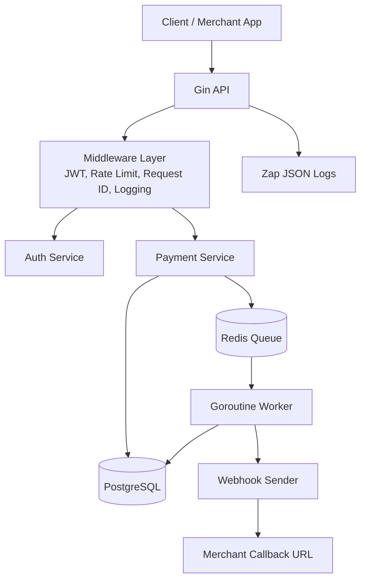

# Flipay Architecture

Flipay is a mini payment gateway API designed to demonstrate fintech backend engineering patterns with Go, PostgreSQL, Redis, JWT, async workers, and webhook callbacks.

## High-Level Architecture

## JWT Auth Flow

1. Client calls `POST /api/v1/auth/register` or `POST /api/v1/auth/login`.
2. Passwords are hashed with bcrypt before storage.
3. API returns a signed JWT access token.
4. Protected routes require `Authorization: Bearer <token>`.
5. Middleware validates the token and stores `user_id` in Gin context.

## Payment Flow

1. Client creates a payment with optional `Idempotency-Key`.
2. Service generates `reference_no`, VA number or QRIS string.
3. Repository stores payment and idempotency data in one PostgreSQL transaction.
4. Service pushes a compact job to Redis.
5. Worker processes the job asynchronously and updates payment status.
6. Webhook sender notifies merchant callback URL.

## Retry Mechanism

- Worker retries failed jobs with exponential backoff skeleton.
- Retry attempts are stored in the Redis job payload.
- Jobs that exceed max attempts are logged as dead-letter candidates.
- Future production work can move exhausted jobs to a Redis dead-letter queue.

## Structured Logging Layer

- Every request gets `X-Request-ID`.
- Request logs include method, path, status, latency, and client IP.
- Worker and webhook logs include payment IDs and error details.
- Logs are JSON using Zap for production observability.
